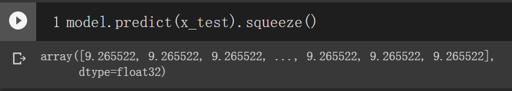

# Problem Solving

發現`pred.csv`預測的所有值(包含所有train/val的預測值)都預測為同一定值

一開始發現optimizer更換為除了SGD外別種方法就正常
，所以以為是SGD function出問題，直到...

感謝Tolkien同學發現
[此文章](https://blog.csdn.net/yeziand01/article/details/106406731)

原因: 
* 因為activation function使用relu，推測可能是所有input皆落在截止區，所以無論input為多少ouput都唯一定值

解決辦法：
1. 改用別的optimizer method ex: Adam、RMSprop
2. 更改activation function ex: tanh
