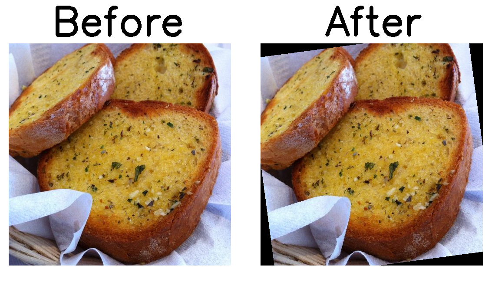
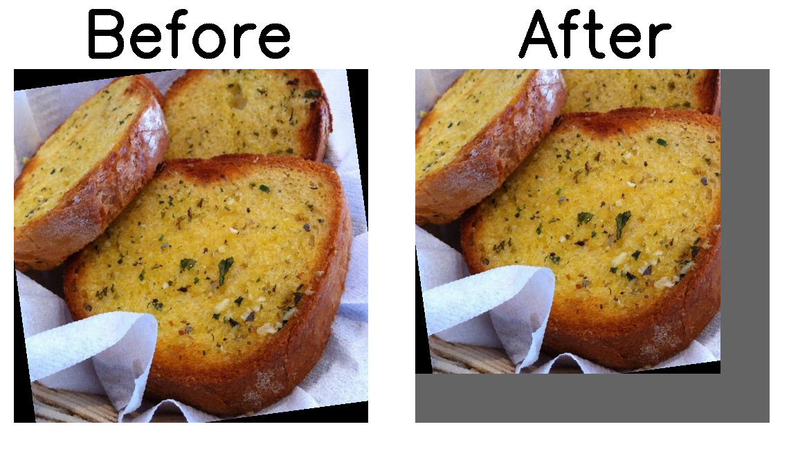
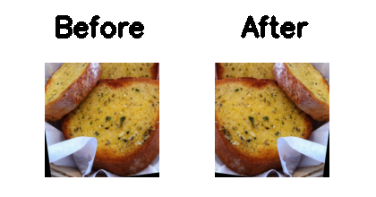
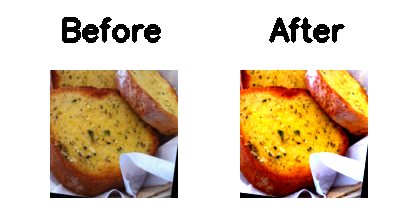

# Data Augmentation
Do some image preprocessing to increse the quatity of data in disguised form. These process will make the model less prone to overfitting.
```python
train_tfm = transforms.Compose([
    transforms.RandomRotation(10, expand=False, center=None),
    transforms.RandomCrop(np.random.randint(350,500),pad_if_needed=True),
    transforms.Resize((128, 128)),
    transforms.RandomHorizontalFlip(p=0.5), 
    transforms.ColorJitter(brightness=(0.7,1.5), contrast=(0.7,1.3), saturation=(0.7,1.5)),
    transforms.ToTensor()
])
```


1. RandomRotation
```python
transforms.RandomRotation(10, expand=False, center=None)
# randomly rotate image +10 ~ -10 dgree
# expand: whether keep the image on non-rectangle part
# center: whether the rotate center is the image center
```
<p align="center"></p>
2. RandomCrop
```python
transforms.RandomCrop(np.random.randint(350,500),pad_if_needed=True)
# randomly crop the image to 350x350 ~ 500x500 px
# pad_if_needed: 
```
<p align="center"></p>
3. Resize
```python
transforms.Resize((128, 128)
# resize image to 128x128 px
```
<p align="center"></p>
4. RandomHorizontalFlip
```python
transforms.RandomHorizontalFlip(p=0.5)
# p: have 0.5 probability ot filp (half of images not change)
```
<p align="center"></p>
5. ColorJitter
```python
transforms.ColorJitter(brightness=(0.7,1.5), contrast=(0.7,1.3), saturation=(0.7,1.5)
# (p1,p2): randomly change the color information from p1 ~ p2
# brightness, contrast, saturation: 3 parameters to chage color information
```
<p align="center"></p>


reference:

# Ensemble and Cross validation 

using
[ensemble_train.ipynb](ML_HW03_Image_Classification_ensemble_train.ipynb)
to train and usng
[ensemble_test.ipynb](HW03/ML_HW03_Image_Classification_ensemble_test.ipynb)

Data in release included model and .


ID_1  | ID_2 | ID_3 | ID_4 
------|-------|------|------
0. | 02:10 |  500 |    0

training curve
