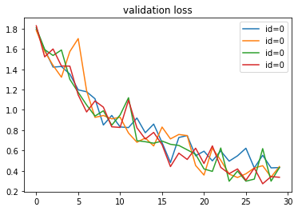

# Data Augmentation
Do some image preprocessing to increse the quatity of data in disguised form. These process will make the model less prone to overfitting.
```python
train_tfm = transforms.Compose([
    transforms.RandomRotation(10, expand=False, center=None),
    transforms.RandomCrop(np.random.randint(350,500),pad_if_needed=True),
    transforms.Resize((128, 128)),
    transforms.RandomHorizontalFlip(p=0.5), 
    transforms.ColorJitter(brightness=(0.7,1.5), contrast=(0.7,1.3), saturation=(0.7,1.5)),
    transforms.ToTensor()
])
```

1. RandomRotation
```python
transforms.RandomRotation(10, expand=False, center=None)
# randomly rotate image +10 ~ -10 dgree
# expand: whether keep the image on non-rectangle part
# center: whether the rotate center is the image center
```
<p align="center"></p>
2. RandomCrop

```python
transforms.RandomCrop(np.random.randint(350,500),pad_if_needed=True)
# randomly crop the image to 350x350 ~ 500x500 px
# pad_if_needed: 
```
<p align="center"></p>
3. Resize

```python
transforms.Resize((128, 128)
# resize image to 128x128 px
```
<p align="center"></p>
4. RandomHorizontalFlip

```python
transforms.RandomHorizontalFlip(p=0.5)
# p: have 0.5 probability ot filp (half of images not change)
```
<p align="center"></p>
5. ColorJitter

```python
transforms.ColorJitter(brightness=(0.7,1.5), contrast=(0.7,1.3), saturation=(0.7,1.5)
# (p1,p2): randomly change the color information from p1 ~ p2
# brightness, contrast, saturation: 3 parameters to chage color information
```
<p align="center"></p>


Reference: [常用图像处理与数据增强方法合集](https://blog.csdn.net/qq_42951560/article/details/109852790)

# Ensemble and Cross validation 

</a>  
[▲ cross validation explain](https://youtu.be/GXLwjQ_O50g?t=457)

**Q:** The result of prediction may be different in each model. How does it solve the ensembling problem?  
In this program, I use voting which is processed by 'sorting the model from high to low according the accuracy. And use `scipy.stats.mode()` to find the mode and it choose the eariler index (more close to 0) when the same weight happened'.

#### Description of each program
Using
[ensemble_train.ipynb](ML_HW03_Image_Classification_ensemble_train.ipynb)
to train 4 models,  
`model_id` is used for recongnizing which model it is and determining how to distribute the training sets and validation sets.   


and using
[ensemble_test.ipynb](HW03/ML_HW03_Image_Classification_ensemble_test.ipynb)
to wrap up 4 models and make the final prediciton.  
[Data]() in release included model and training&validation accuracy in each epoch.

#### validation Result

  /  | ID_1  | ID_2 |  ID_3 | ID_4 
-----|------|-------|-------|------
loss| 0.298 | 0.273 | 0.334 | 0.432
acc | 0.909 | 0.907 | 0.891 | 0.858

#### training curve

<table><tr>
<td></td>
<td></td>
</tr></table>


